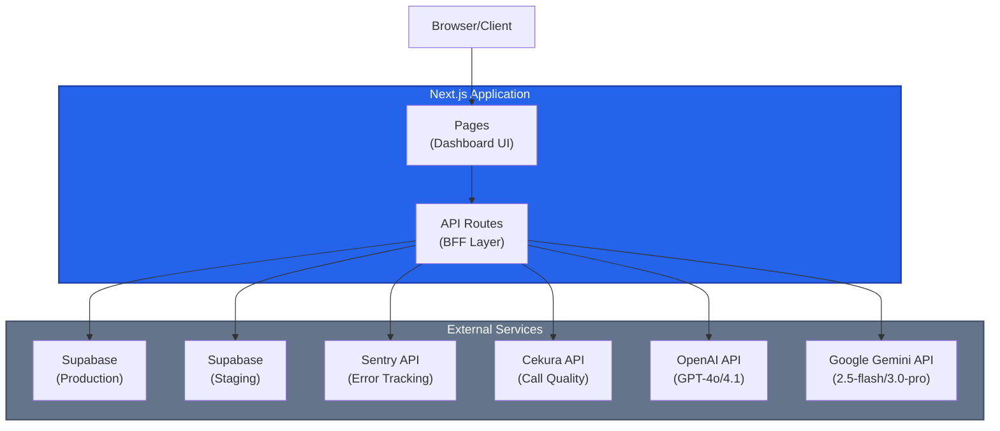
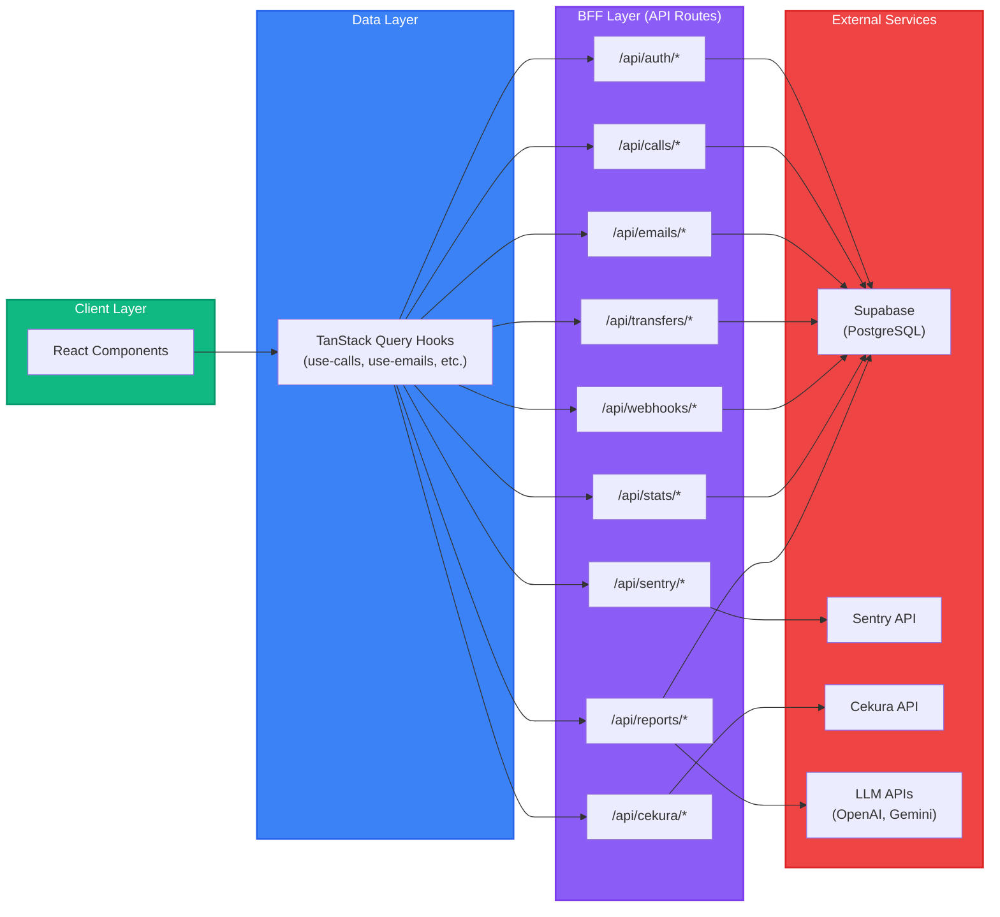
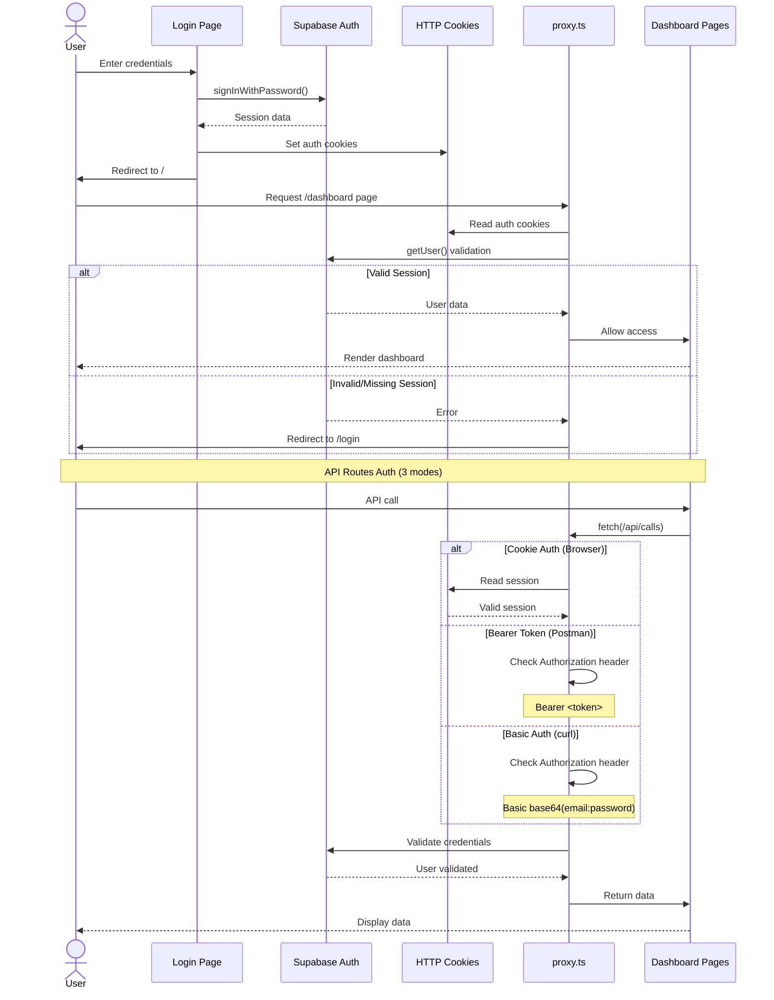
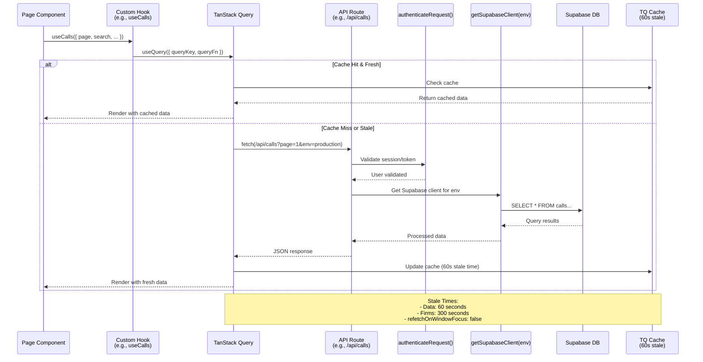
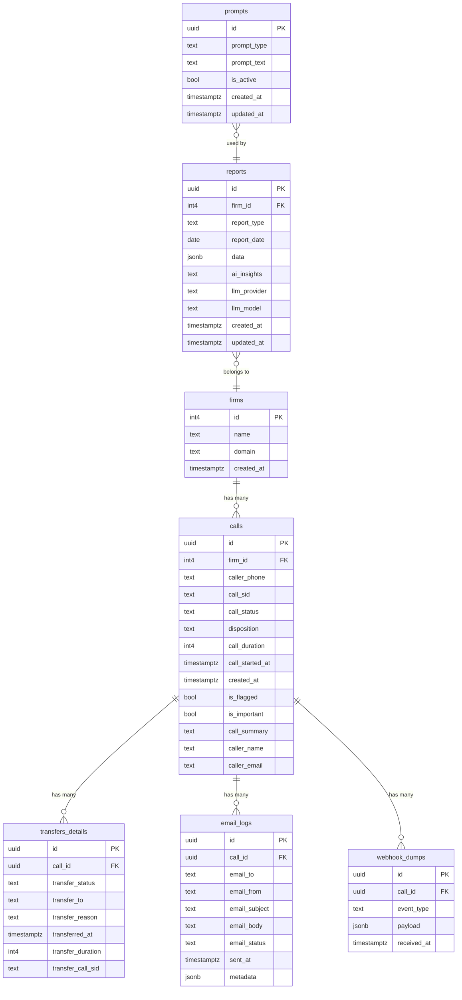
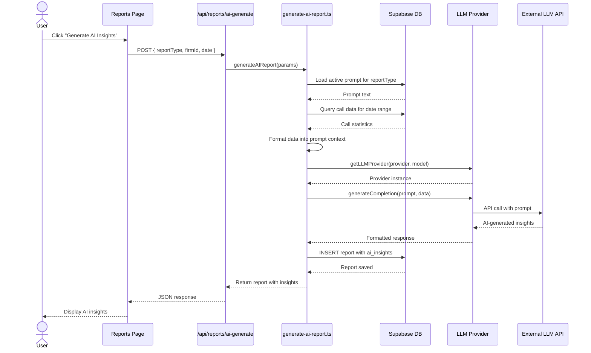
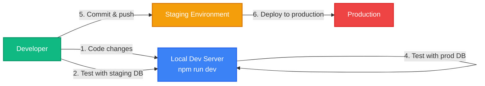
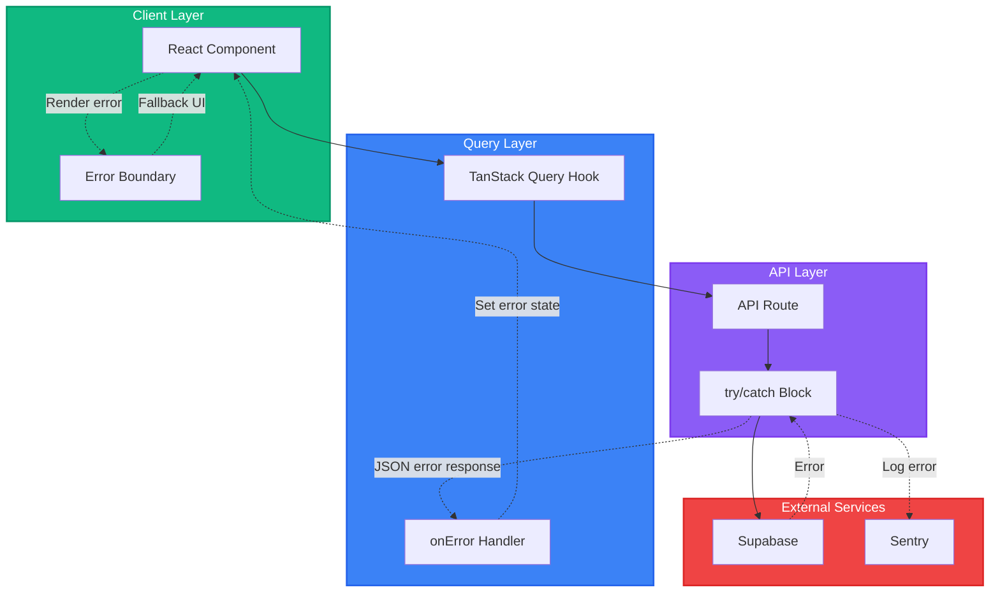
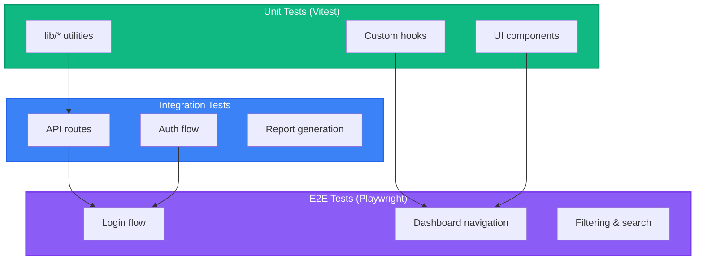

# Architecture Overview

## System Summary

AI Receptionist Dashboard is a Next.js 16 internal dashboard for monitoring AI-powered legal call center operations. Built with React 19, TypeScript, Tailwind CSS v4, and shadcn/ui. It follows the BFF (Backend-for-Frontend) pattern where all external API calls go through Next.js API routes. Data lives in two Supabase PostgreSQL projects (production and staging), with external integrations to Sentry (error tracking) and Cekura (call observability).

**Tech Stack:**
- **Frontend**: Next.js 16 (App Router, Turbopack), React 19, TypeScript (strict), TanStack Query, TanStack Table, Recharts
- **Backend**: Next.js API Routes (BFF pattern)
- **Database**: Supabase (PostgreSQL) - separate production and staging projects
- **Auth**: Supabase Auth (email/password + OAuth) with cookie-based sessions
- **External APIs**: Sentry (error tracking), Cekura (call quality observability)
- **AI/LLM**: OpenAI (GPT-4o/4.1) and Google Gemini (2.5-flash/3.0-pro) for report generation
- **Styling**: Tailwind CSS v4, shadcn/ui (Radix primitives), OKLCH color space

## High-Level Architecture



## BFF (Backend-for-Frontend) Pattern

The BFF pattern ensures all external API calls are proxied through Next.js API routes, keeping credentials server-side and providing centralized error handling, caching, and request validation.



**Key Benefits:**
- All external credentials (Supabase service keys, Sentry token, Cekura API key) remain server-side
- React hooks never call Supabase directly (except for auth operations)
- API routes handle input validation, SQL injection prevention, and response shaping
- Single point for caching strategies and error handling

## Authentication Flow



**Auth Modes for API Routes:**
1. **Cookie-based** (Browser): Session cookies set by Supabase Auth
2. **Bearer Token** (Postman): `Authorization: Bearer <access_token>`
3. **Basic Auth** (curl): `Authorization: Basic base64(email:password)`

**OAuth Email Allowlist:**
- OAuth users (Google, etc.) are checked against `ALLOWED_EMAILS` environment variable
- Enforced in `/app/auth/callback/route.ts`

## Environment Switching

The dashboard supports switching between production and staging Supabase environments without redeploying.

```mermaid
graph TB
    User[User Action]

    subgraph Client["Client (Browser)"]
        EnvProvider["EnvironmentProvider<br/>(localStorage)"]
        EnvSwitch["Environment Switch Button"]
    end

    subgraph Hooks["TanStack Query Hooks"]
        UseCalls["use-calls.ts"]
        UseEmails["use-emails.ts"]
        UseTransfers["use-transfers.ts"]
        UseOther["Other hooks..."]
    end

    subgraph APIRoutes["API Routes"]
        CallsRoute["/api/calls"]
        EmailsRoute["/api/emails"]
        TransfersRoute["/api/transfers"]
        GetClient["getSupabaseClient(env)"]
    end

    subgraph Supabase["Supabase Projects"]
        Prod["Production Database"]
        Staging["Staging Database"]
    end

    User --> EnvSwitch
    EnvSwitch --> EnvProvider
    EnvProvider --> UseCalls
    EnvProvider --> UseEmails
    EnvProvider --> UseTransfers
    EnvProvider --> UseOther

    UseCalls -->|"?env=production"| CallsRoute
    UseEmails -->|"?env=production"| EmailsRoute
    UseTransfers -->|"?env=staging"| TransfersRoute
    UseOther -->|"?env=..."| GetClient

    CallsRoute --> GetClient
    EmailsRoute --> GetClient
    TransfersRoute --> GetClient

    GetClient -->|env="production"| Prod
    GetClient -->|env="staging"| Staging

    EnvProvider -.->|Invalidates ALL caches| UseCalls
    EnvProvider -.->|Invalidates ALL caches| UseEmails
    EnvProvider -.->|Invalidates ALL caches| UseTransfers
    EnvProvider -.->|Invalidates ALL caches| UseOther

    style Client fill:#10b981,stroke:#059669,stroke-width:2px,color:#fff
    style Hooks fill:#3b82f6,stroke:#2563eb,stroke-width:2px,color:#fff
    style APIRoutes fill:#8b5cf6,stroke:#7c3aed,stroke-width:2px,color:#fff
    style Supabase fill:#ef4444,stroke:#dc2626,stroke-width:2px,color:#fff
```

**Key Details:**
- **Auth always uses staging**: All authentication operations use the staging Supabase project
- **Data queries switch**: Calls, emails, transfers, etc. respect the environment setting
- **Cache invalidation**: Switching environments invalidates ALL TanStack Query caches to prevent stale data
- **Persistence**: Environment preference stored in `localStorage`

## Data Fetching Pattern

Standard pattern for all data queries in the application.



**Caching Strategy:**
- **Data queries**: 60-second stale time (calls, emails, transfers, webhooks, stats)
- **Firms list**: 300-second stale time (rarely changes)
- **Window focus**: `refetchOnWindowFocus: false` (no automatic refetch when tab regains focus)
- **Background refetch**: Enabled for automatic updates when data becomes stale

## Project Structure

```
app/
├── (auth)/                      # Public auth pages
│   ├── login/                   # Login page
│   ├── forgot-password/         # Password reset request
│   └── reset-password/          # Password reset form
├── (dashboard)/                 # Protected pages (require auth)
│   ├── page.tsx                 # Home (KPI overview)
│   ├── calls/                   # Call listing & detail pages
│   ├── emails/                  # Email listing
│   ├── transfers/               # Transfer listing
│   ├── webhooks/                # Webhook event listing
│   ├── sentry/                  # Sentry error browsing
│   └── reports/                 # EOD & weekly reports
├── api/                         # BFF API routes (28 route.ts files)
│   ├── auth/                    # Login, logout, session
│   │   ├── login/route.ts
│   │   ├── logout/route.ts
│   │   └── session/route.ts
│   ├── calls/                   # Call listing, detail, flagged, important
│   │   ├── route.ts
│   │   ├── [id]/route.ts
│   │   ├── flagged/route.ts
│   │   └── important/route.ts
│   ├── emails/                  # Email listing
│   │   └── route.ts
│   ├── transfers/               # Transfer listing
│   │   └── route.ts
│   ├── webhooks/                # Webhook listing
│   │   └── route.ts
│   ├── stats/                   # KPI overview, chart data
│   │   ├── overview/route.ts
│   │   └── charts/route.ts
│   ├── firms/                   # Firm listing
│   │   └── route.ts
│   ├── sentry/                  # Sentry event browsing, error checking
│   │   ├── events/route.ts
│   │   ├── check/route.ts
│   │   └── [id]/route.ts
│   ├── cekura/                  # Cekura call mapping, status, feedback
│   │   ├── map/route.ts
│   │   ├── status/route.ts
│   │   └── feedback/route.ts
│   └── reports/                 # EOD/weekly report generation, AI insights
│       ├── route.ts
│       ├── ai-generate/route.ts
│       └── format-compare/      # New: Format comparison endpoint
├── auth/callback/               # OAuth callback handler
│   └── route.ts
└── layout.tsx                   # Root layout (fonts, theme)

components/
├── providers/                   # React context providers
│   ├── environment-provider.tsx # Prod/staging switching
│   ├── query-provider.tsx       # TanStack Query setup
│   ├── theme-provider.tsx       # Dark/light theme
│   └── date-filter-provider.tsx # Shared date filter state
├── layout/                      # Layout components
│   └── navbar.tsx               # Top navigation bar
└── ui/                          # 28 shadcn/ui components
    ├── button.tsx
    ├── input.tsx
    ├── table.tsx
    ├── dialog.tsx
    └── ...

hooks/                           # TanStack Query hooks + utility hooks
├── use-calls.ts                 # Call listing, detail, flagged, important
├── use-emails.ts                # Email listing
├── use-transfers.ts             # Transfer listing
├── use-webhooks.ts              # Webhook listing
├── use-stats.ts                 # KPI overview, chart data
├── use-firms.ts                 # Firm listing
├── use-sentry.ts                # Sentry event browsing
├── use-cekura.ts                # Cekura call mapping, feedback
├── use-eod-reports.ts           # EOD/weekly reports
├── use-environment.ts           # Environment switching
├── use-date-filter.ts           # Shared date filter
└── ...

lib/
├── api/                         # Shared API utilities
│   ├── auth.ts                  # API route authentication
│   └── utils.ts                 # SQL injection prevention, input validation
├── auth/                        # Auth config & session management
│   ├── config.ts                # Supabase auth client factory
│   ├── session.ts               # Session validation
│   └── email-allowlist.ts       # OAuth email whitelist
├── supabase/                    # Supabase client factory
│   └── client.ts                # getSupabaseClient(env) - prod/staging data clients
├── llm/                         # LLM provider abstraction
│   ├── providers/               # OpenAI & Gemini implementations
│   │   ├── openai.ts
│   │   ├── gemini.ts
│   │   └── index.ts             # Provider factory
│   └── types.ts                 # LLM interfaces
├── eod/                         # AI report generation
│   ├── generate-ai-report.ts    # Report generation logic
│   └── prompts.ts               # Report generation prompts
├── sentry/                      # Sentry API client
│   └── client.ts
├── format-phone.ts              # Phone number formatting
├── format-duration.ts           # Duration formatting
├── format-date.ts               # Date formatting
├── share.ts                     # Web Share API wrapper
├── webhook-utils.ts             # Webhook event parsing
├── filters.ts                   # Filter utilities
├── constants.ts                 # App-wide constants
└── utils.ts                     # General utilities (cn, etc.)

types/
├── database.ts                  # Supabase table interfaces
└── api.ts                       # API response types
```

## Database Schema



**Key Relationships:**
- `firms` has many `calls` (one-to-many)
- `calls` has many `transfers_details` (one-to-many)
- `calls` has many `email_logs` (one-to-many)
- `calls` has many `webhook_dumps` (one-to-many)
- `reports` belongs to `firms` (many-to-one)
- `reports` uses `prompts` (many-to-one)

## Key Files Reference

| File | Purpose | Modify For |
|------|---------|-----------|
| `proxy.ts` | Auth gate for all requests | Adding public routes, changing auth behavior |
| `lib/supabase/client.ts` | Supabase client factory | Adding new environments, connection config |
| `lib/api/auth.ts` | API route authentication | Adding auth methods, changing validation |
| `lib/api/utils.ts` | Input validation, SQL safety | Adding validators, new utilities |
| `lib/constants.ts` | App-wide constants | Adding filter options, changing defaults |
| `components/providers/environment-provider.tsx` | Prod/staging switching | Adding environments |
| `components/providers/date-filter-provider.tsx` | Shared date filter state | Changing default date range |
| `lib/llm/providers/index.ts` | LLM provider factory | Adding new LLM providers |
| `lib/eod/generate-ai-report.ts` | AI report generation | Changing report formats, prompts |
| `lib/auth/config.ts` | Supabase auth client setup | Modifying auth configuration |
| `lib/auth/session.ts` | Session validation logic | Changing session behavior |
| `lib/sentry/client.ts` | Sentry API integration | Updating Sentry API calls |
| `lib/format-*.ts` | Formatting utilities | Changing display formats |
| `hooks/use-*.ts` | Data fetching hooks | Adding new data queries |
| `types/database.ts` | Database type definitions | Syncing with DB schema changes |
| `types/api.ts` | API response types | Updating API contracts |

## Security Patterns

### 1. SQL Injection Prevention

All user inputs that go into SQL queries are sanitized using dedicated utilities:

```typescript
// lib/api/utils.ts
escapeLikePattern(pattern: string) // Escapes %, _, \ for LIKE queries
buildSafeSearchTerm(term: string)   // Trims and escapes search terms
```

**Whitelist for Filter Columns:**
- Only predefined columns can be filtered/sorted
- Column names are validated against a whitelist before building queries

### 2. Input Validation

All API route inputs are validated before processing:

```typescript
// lib/api/utils.ts
parseIntOrNull(value: string | null)         // Returns null for invalid ints
parseIntOrDefault(value: string | null, default: number) // Returns default for invalid ints
isValidInt4(value: number)                   // Validates PostgreSQL int4 range
```

**Pagination Limits:**
- Maximum page size: 100 items
- Page numbers validated as positive integers

### 3. Authentication

**Multi-layered Auth:**
1. **proxy.ts**: Validates every non-public request before page renders
2. **API routes**: Double-check via `authenticateRequest()` for API calls

**Three Auth Modes:**
- Cookie-based (browser sessions)
- Bearer token (Postman/API clients)
- Basic auth (curl/scripts)

### 4. Credentials Management

**Server-Side Only:**
- Supabase service keys (never exposed to client)
- Sentry auth token (API routes only)
- Cekura API key (API routes only)
- OpenAI API key (report generation only)
- Gemini API key (report generation only)

### 5. Email Allowlist

OAuth users are validated against `ALLOWED_EMAILS` environment variable:

```typescript
// lib/auth/email-allowlist.ts
isEmailAllowed(email: string): boolean
```

Enforced in `/app/auth/callback/route.ts` for Google OAuth.

### 6. XSS Protection

**Built-in Protection:**
- React's automatic escaping for all dynamic content
- No use of `dangerouslySetInnerHTML` except for email body display (which is sanitized)

**Safe HTML Rendering:**
- Email bodies are the only user-generated HTML rendered
- Consider adding DOMPurify for email body sanitization in future

### 7. Rate Limiting

**Not Currently Implemented:**
- Consider adding rate limiting middleware for API routes
- Especially important for LLM API endpoints (expensive operations)

## LLM Integration Architecture

The dashboard uses OpenAI and Google Gemini for AI-powered report generation.

```mermaid
graph TB
    subgraph Client["Client Layer"]
        ReportsPage["Reports Page"]
        GenerateButton["Generate AI Insights Button"]
    end

    subgraph API["API Layer"]
        GenerateRoute["/api/reports/ai-generate"]
        ReportLib["lib/eod/generate-ai-report.ts"]
    end

    subgraph LLM["LLM Provider Layer"]
        Factory["lib/llm/providers/index.ts<br/>(Provider Factory)"]
        OpenAI["OpenAI Provider<br/>(GPT-4o, GPT-4.1)"]
        Gemini["Gemini Provider<br/>(2.5-flash, 3.0-pro)"]
    end

    subgraph External["External APIs"]
        OpenAIAPI["OpenAI API"]
        GeminiAPI["Google Gemini API"]
    end

    subgraph DB["Database"]
        Supabase["Supabase<br/>(prompts, reports tables)"]
    end

    ReportsPage --> GenerateButton
    GenerateButton --> GenerateRoute
    GenerateRoute --> ReportLib
    ReportLib --> Supabase
    Supabase -->|Load prompts| ReportLib
    ReportLib --> Factory
    Factory -->|provider="openai"| OpenAI
    Factory -->|provider="gemini"| Gemini
    OpenAI --> OpenAIAPI
    Gemini --> GeminiAPI
    OpenAIAPI -->|AI insights| ReportLib
    GeminiAPI -->|AI insights| ReportLib
    ReportLib --> Supabase
    Supabase -->|Save report| ReportLib
    ReportLib --> GenerateRoute
    GenerateRoute --> ReportsPage

    style Client fill:#10b981,stroke:#059669,stroke-width:2px,color:#fff
    style API fill:#3b82f6,stroke:#2563eb,stroke-width:2px,color:#fff
    style LLM fill:#8b5cf6,stroke:#7c3aed,stroke-width:2px,color:#fff
    style External fill:#ef4444,stroke:#dc2626,stroke-width:2px,color:#fff
    style DB fill:#f59e0b,stroke:#d97706,stroke-width:2px,color:#fff
```

**Provider Abstraction:**
- Unified interface for multiple LLM providers
- Easy to add new providers (Claude, etc.)
- Model selection per report type (EOD vs weekly)

**Prompt Management:**
- Prompts stored in `prompts` table
- Versioned and activatable
- Can be updated without code changes

## Report Generation Flow



**Key Features:**
- Async generation with loading states
- Error handling with fallback
- Token usage tracking
- Model/provider logging for debugging
- Caching of generated reports

## Environment Variables

### Required

```bash
# Supabase Configuration
SUPABASE_URL=https://xxx.supabase.co           # Supabase project URL
SUPABASE_KEY=xxx                               # Supabase anon/service key

# JWT Authentication
JWT_SECRET=xxx                                  # Secret for signing JWT sessions
```

### Optional - External Integrations

```bash
# Sentry Integration (Error Tracking)
SENTRY_ORG=ai-receptionist                      # Sentry organization slug
SENTRY_PROJECT=ai-receptionist-dashboard        # Sentry project slug
SENTRY_AUTH_TOKEN=xxx                           # Sentry API token

# Cekura Integration (Call Quality)
CEKURA_API_KEY=xxx                              # Cekura API key

# LLM Providers (Report Generation)
OPENAI_API_KEY=xxx                              # OpenAI API key
GOOGLE_AI_API_KEY=xxx                           # Google Gemini API key
```

### Optional - Multi-Environment

```bash
# Production Supabase
SUPABASE_PROD_URL=https://xxx.supabase.co
SUPABASE_PROD_KEY=xxx

# Staging Supabase (used for auth by default)
SUPABASE_STAGING_URL=https://yyy.supabase.co
SUPABASE_STAGING_KEY=yyy
```

### Optional - OAuth

```bash
# Email Allowlist for OAuth
ALLOWED_EMAILS=user1@example.com,user2@example.com
```

## Development Workflow



**Best Practices:**
1. Always test with staging DB first
2. Use environment switcher to verify against production data
3. Run `npm run lint` before committing
4. No direct database migrations - use Supabase dashboard
5. Keep auth on staging to avoid polluting production users

## Deployment Architecture

```mermaid
graph TB
    subgraph GitHub["GitHub Repository"]
        Main[main branch]
        Feature[feature/* branches]
    end

    subgraph CI["CI/CD (Vercel)"]
        Build[Build Next.js App]
        Test[Run ESLint]
    end

    subgraph Vercel["Vercel Platform"]
        Preview[Preview Deployments<br/>(feature branches)]
        Production[Production Deployment<br/>(main branch)]
    end

    subgraph External["External Services"]
        SupaProd[Supabase Production]
        SupaStaging[Supabase Staging]
        SentryExt[Sentry]
        CekuraExt[Cekura]
    end

    Feature -->|Push| CI
    Main -->|Push/Merge| CI
    CI --> Build
    Build --> Test
    Test -->|Success| Preview
    Test -->|Success| Production
    Preview --> SupaStaging
    Production --> SupaProd
    Production --> SupaStaging
    Production --> SentryExt
    Production --> CekuraExt

    style GitHub fill:#6e5494,stroke:#553c7a,stroke-width:2px,color:#fff
    style CI fill:#3b82f6,stroke:#2563eb,stroke-width:2px,color:#fff
    style Vercel fill:#000,stroke:#333,stroke-width:2px,color:#fff
    style External fill:#64748b,stroke:#475569,stroke-width:2px,color:#fff
```

**Deployment Strategy:**
- **Main branch**: Auto-deploys to production
- **Feature branches**: Auto-deploys to preview URLs
- **Environment variables**: Managed in Vercel dashboard
- **No manual deployment**: All automated via Git push

## Performance Considerations

### 1. Data Fetching
- **TanStack Query caching**: 60s stale time for most queries
- **Pagination**: Server-side, max 100 items per page
- **Lazy loading**: Components load data only when visible

### 2. Database Queries
- **Indexed columns**: `call_started_at`, `firm_id`, `call_status`, `disposition`
- **Query optimization**: Use `.select()` to fetch only needed columns
- **Aggregations**: Done in PostgreSQL, not in JavaScript

### 3. Bundle Size
- **Next.js code splitting**: Automatic per-route code splitting
- **Turbopack**: Faster dev builds
- **Dynamic imports**: Heavy components loaded on-demand

### 4. API Response Size
- **Pagination**: Limits response sizes
- **Field selection**: API routes return only necessary fields
- **JSON compression**: Handled by Next.js automatically

### 5. Future Optimizations
- Add Redis for API response caching
- Implement request deduplication for parallel queries
- Add service worker for offline support
- Consider React Server Components for initial page loads

## Error Handling



**Error Handling Layers:**
1. **API Routes**: try/catch blocks, return structured JSON errors
2. **TanStack Query**: `onError` handlers, error state management
3. **React Components**: Error boundaries for unhandled errors
4. **External Logging**: All errors logged to Sentry

**Error Response Format:**
```json
{
  "error": "Human-readable error message",
  "code": "ERROR_CODE",
  "details": {}
}
```

## Testing Strategy

**Current State:**
- No test framework configured yet

**Recommended Testing Approach:**



**Priority Testing Areas:**
1. **Auth flows**: Login, logout, session validation
2. **API routes**: Input validation, SQL injection prevention
3. **Report generation**: LLM integration, prompt handling
4. **Environment switching**: Cache invalidation, data consistency

## Future Enhancements

### 1. Real-Time Features
- WebSocket connection for live call status updates
- Real-time notifications for important calls
- Live dashboard metrics without polling

### 2. Advanced Analytics
- Custom report builder with drag-and-drop
- Trend analysis with ML predictions
- Export to Excel/PDF with charts

### 3. User Management
- Role-based access control (admin, viewer, analyst)
- Audit logs for sensitive actions
- Team collaboration features

### 4. Performance
- Redis caching layer for expensive queries
- Background job queue for report generation
- Incremental static regeneration for dashboard pages

### 5. Monitoring
- Performance monitoring with Sentry
- Database query performance tracking
- API response time dashboards

---

**Document Version**: 1.0
**Last Updated**: 2026-02-08
**Maintained By**: AI Receptionist Engineering Team