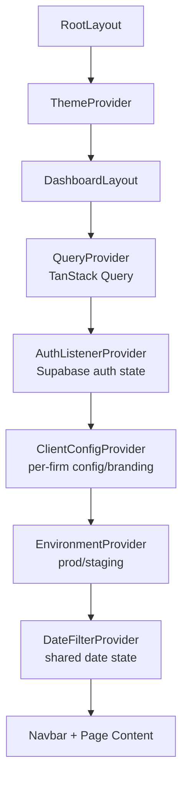

# Hooks and Providers

## Providers (React Context)

### Provider Nesting Order



The nesting order is critical. Each provider depends on the outer providers:
- ThemeProvider must wrap entire app for dark/light mode
- QueryProvider must be in layout for client-side hooks
- AuthListenerProvider monitors Supabase auth state changes
- ClientConfigProvider fetches per-firm config and applies branding
- EnvironmentProvider must wrap all data fetching
- DateFilterProvider wraps pages that need shared date filtering

### QueryProvider (`components/providers/query-provider.tsx`)

**Purpose:** Creates and provides TanStack QueryClient instance for all data fetching hooks.

**Configuration:**
```typescript
{
  defaultOptions: {
    queries: {
      staleTime: 60 * 1000, // 60 seconds
      refetchOnWindowFocus: false,
    },
  },
}
```

**Key behavior:**
- Uses `useState(() => new QueryClient(...))` to ensure stable instance
- Single QueryClient for entire app lifetime
- All queries inherit 60s stale time by default (firms override to 300s)

### EnvironmentProvider (`components/providers/environment-provider.tsx`)

**Purpose:** Manages production vs staging environment switching for data queries.

**Context API:**
```typescript
{
  environment: 'production' | 'staging',
  setEnvironment: (env: 'production' | 'staging') => void
}
```

**Storage:**
- localStorage key: `hc-dashboard-environment`
- Default: `'production'`
- Persists across sessions

**On environment switch:**
1. Updates state
2. Persists to localStorage
3. Calls `queryClient.invalidateQueries()` to clear ALL caches
4. All hooks refetch with new environment

**Hydration:**
- Returns `null` until localStorage is read (prevents flash of wrong environment)
- Client-side only (no SSR)

**Important:** Auth always uses staging Supabase. Only data queries respect this setting.

### ThemeProvider (`components/providers/theme-provider.tsx`)

**Purpose:** Wrapper around next-themes ThemeProvider for dark/light mode.

**Configuration:**
```typescript
{
  attribute: "class",
  defaultTheme: "system",
  enableSystem: true,
  disableTransitionOnChange: true,
}
```

**Supported themes:**
- `light` - Light mode
- `dark` - Dark mode
- `system` - Match OS preference

**Usage in components:**
```typescript
import { useTheme } from 'next-themes'

const { theme, setTheme } = useTheme()
```

### ClientConfigProvider (`components/providers/client-config-provider.tsx`)

**Purpose:** Fetches per-firm configuration from `/api/client-config` and applies firm-specific branding (CSS custom properties, document title, forced light theme for branded firms).

**Context API:**
```typescript
{
  config: ClientConfig | null;
  isAdmin: boolean;
  isLoading: boolean;
}
```

**Behavior:**
1. On mount: fetches `/api/client-config` to resolve the current user's config
2. If branding is present, applies CSS variables (`--primary`, etc.) and updates `document.title`
3. Forces light theme for branded firms (overrides user's dark mode preference)
4. Provides `isAdmin` flag for admin-only UI gating

**Used by:**
- Admin layout (checks `isAdmin` for access control)
- Navbar (conditional page links based on `pages` config)
- Feature-gated components (chat, cekura, accurate transcript)

### AuthListenerProvider (`components/providers/auth-listener-provider.tsx`)

**Purpose:** Monitors Supabase auth state changes (login, logout, token refresh) and keeps the app in sync.

**Behavior:**
1. Subscribes to `supabase.auth.onAuthStateChange`
2. On `SIGNED_OUT`: redirects to `/login`
3. On `TOKEN_REFRESHED`: updates session cookies
4. Cleans up subscription on unmount

**Why a provider?** Auth state changes can happen outside of React (e.g., token expiry), so a global listener ensures the app always reacts.

### DateFilterProvider (`components/providers/date-filter-provider.tsx`)

**Purpose:** Shared date range state across multiple dashboard pages.

**Context API:**
```typescript
{
  dateFilterMode: 'today' | 'yesterday' | 'custom' | 'all',
  startDate: string | null,      // ISO 8601 date
  endDate: string | null,          // ISO 8601 date
  setDateFilterMode: (mode) => void,
  setStartDate: (date: string | null) => void,
  setEndDate: (date: string | null) => void,
  resetToDefault: () => void,
}
```

**Storage:**
- localStorage key: `hc-dashboard-date-filter`
- Default: `{ mode: 'custom', startDate: 7 days ago, endDate: today }`

**Used by:**
- Calls page
- Emails page
- Transfers page
- Webhooks page

**NOT used by:**
- Sentry page (has own date filtering)
- Reports page (has own date filtering)
- Home page (uses overview stats)

**Persistence:** Survives page refresh and navigation.

## Data Fetching Hooks

All data fetching hooks use TanStack Query with consistent patterns:
- Export from `/hooks` directory
- Use environment from EnvironmentProvider
- Include environment in queryKey
- Return typed data with loading/error states

### useCalls (`hooks/use-calls.ts`)

**Exports:**
- `useCalls` - Paginated call list
- `useCallDetail` - Single call detail
- `useImportantCallIds` - Set of important call IDs
- `useTransferEmailMismatchIds` - Set of mismatch call IDs
- `usePrefetchCallDetails` - Prefetch adjacent calls for carousel

#### useCalls

**API:** `GET /api/calls`

**Query key:** `['calls', 'list', env, filters]`

**Stale time:** 60s

**Input type:**
```typescript
interface CallFilters {
  page?: number;
  pageSize?: number;
  sortBy?: string;
  sortOrder?: 'asc' | 'desc';
  search?: string;
  startDate?: string;
  endDate?: string;
  firmIds?: number[];
  status?: string;
  // ... more filters
}
```

**Return type:** `PaginatedResponse<CallListItem>`

**Special behavior:**
- **impossibleCondition short-circuit:** If filters create impossible query (e.g., firmIds=[]), returns empty result without API call
- **placeholderData:** Uses `keepPreviousData` for smooth pagination transitions

#### useCallDetail

**API:** `GET /api/calls/:id`

**Query key:** `['calls', 'detail', env, id]`

**Stale time:** 60s

**Input:** `id: number | string | null` (numeric ID or UUID correlation ID)

**Enabled:** Only when `id !== null`

**Return type:** `CallDetail | null`

**Special behavior:** Supports both numeric database ID and UUID correlation_id lookup.

#### useImportantCallIds

**API:** `GET /api/calls/important`

**Query key:** `['calls', 'important', env]`

**Stale time:** 60s

**Return type:** `Set<number>` (via select transform)

**Purpose:** Quick lookup for highlighting important calls in UI.

#### useTransferEmailMismatchIds

**API:** `GET /api/calls/transfer-email-mismatch`

**Query key:** `['calls', 'transfer-email-mismatch', env]`

**Stale time:** 60s

**Return type:** `Set<number>` (via select transform)

**Purpose:** Quick lookup for highlighting transfer/email mismatches.

#### usePrefetchCallDetails

**Purpose:** Prefetches adjacent call details for carousel navigation.

**Input:** `{ currentId: number | null, allIds: number[] }`

**Behavior:**
- Prefetches previous and next call in allIds array
- Uses `queryClient.prefetchQuery` (non-blocking)
- Improves perceived performance when navigating carousel

### useEmails (`hooks/use-emails.ts`)

**API:** `GET /api/emails`

**Query key:** `['emails', 'list', env, filters]`

**Stale time:** 60s

**Input type:**
```typescript
interface EmailFilters {
  page?: number;
  pageSize?: number;
  sortBy?: string;
  sortOrder?: 'asc' | 'desc';
  search?: string;
  startDate?: string;
  endDate?: string;
  firmIds?: number[];
  status?: string;
}
```

**Return type:** `PaginatedResponse<Email>`

### useTransfers (`hooks/use-transfers.ts`)

**API:** `GET /api/transfers`

**Query key:** `['transfers', 'list', env, filters]`

**Stale time:** 60s

**Input type:**
```typescript
interface TransferFilters {
  page?: number;
  pageSize?: number;
  sortBy?: string;
  sortOrder?: 'asc' | 'desc';
  search?: string;
  startDate?: string;
  endDate?: string;
  firmIds?: number[];
}
```

**Return type:** `PaginatedResponse<Transfer>`

### useWebhooks (`hooks/use-webhooks.ts`)

**Exports:**
- `useWebhooks` - Paginated webhook list
- `useWebhooksForCall` - Webhooks for specific call

#### useWebhooks

**API:** `GET /api/webhooks`

**Query key:** `['webhooks', 'list', env, filters]`

**Stale time:** 60s

**Input type:** `WebhookFilters`

**Return type:** `PaginatedResponse<Webhook>`

#### useWebhooksForCall

**API:** `GET /api/webhooks?platformCallId=...`

**Query key:** `['webhooks', 'forCall', env, platformCallId]`

**Stale time:** 60s

**Input:** `platformCallId: string | null`

**Enabled:** Only when `!!platformCallId`

**Return type:** `Webhook[]`

### useOverviewStats (`hooks/use-overview-stats.ts`)

**API:** `GET /api/stats/overview`

**Query key:** `['overview-stats', env, period]`

**Stale time:** 60s

**Input:** `period: 'Today' | 'Yesterday' | 'This Month'`

**Return type:**
```typescript
{
  current: {
    totalCalls: number;
    averageCallDuration: number;
    totalEmails: number;
    timeSaved: number;
  };
  previous: {
    totalCalls: number;
    averageCallDuration: number;
    totalEmails: number;
    timeSaved: number;
  };
}
```

**Purpose:** Powers KPI cards on home page with period-over-period comparison.

### useChartData (`hooks/use-chart-data.ts`)

**API:** `GET /api/stats/chart-data`

**Query key:** `['chart-data', env, startDate, endDate, isHourly]`

**Stale time:** 60s

**Input:**
- `startDate: string`
- `endDate: string`
- `isHourly?: boolean` (auto-detected based on date range)

**Return type:**
```typescript
{
  data: ChartDataPoint[];
  isHourly: boolean;
  totalRecords: number;
}

interface ChartDataPoint {
  timestamp: string;
  totalCalls: number;
  successfulCalls: number;
  failedCalls: number;
  emails: number;
}
```

**Special behavior:** Uses BUSINESS_TIMEZONE ('America/New_York') for date boundaries.

### useFirms (`hooks/use-firms.ts`)

**API:** `GET /api/firms`

**Query key:** `['firms', env]`

**Stale time:** 300s (5 minutes - LONGER than default)

**Return type:**
```typescript
{
  firms: Firm[];
}

interface Firm {
  id: number;
  name: string;
  slug: string;
}
```

**Purpose:** Firm list changes infrequently, so longer cache is appropriate.

### useSentryEvents (`hooks/use-sentry-events.ts`)

**Exports:**
- `useSentryEventsForCall` - Sentry events for specific call
- `useSentryBrowse` - Paginated Sentry events (standard pagination)
- `useSentryBrowseInfinite` - Infinite scroll Sentry events
- `useSentryErrorCorrelationIds` - Set of correlation IDs with errors

#### useSentryBrowse

**API:** `GET /api/sentry/browse`

**Query key:** `['sentry', 'browse', filters]`

**Stale time:** 60s

**Input type:** `SentryBrowseFilters`

**Return type:** `PaginatedResponse<SentryEvent>`

#### useSentryBrowseInfinite

**API:** `GET /api/sentry/browse` (cursor pagination)

**Query key:** `['sentry', 'browse-infinite', filters]`

**Stale time:** 60s

**Return type:** `InfiniteQueryResult<PaginatedResponse<SentryEvent>>`

**Purpose:** Infinite scroll UI for Sentry events page.

#### useSentryErrorCorrelationIds

**API:** `GET /api/sentry/error-check`

**Query key:** `['sentry', 'error-check', env]`

**Stale time:** 60s

**Return type:** `Set<string>` (via select transform)

**Purpose:** Quick lookup for showing error indicators on calls.

### useFlaggedCalls (`hooks/use-flagged-calls.ts`)

**Exports:**
- `useFlaggedCalls` - Paginated flagged call list
- `useFlaggedCount` - Total count of flagged calls

#### useFlaggedCalls

**API:** `GET /api/calls/flagged`

**Query key:** `['calls', 'flagged', 'list', env, filters]`

**Stale time:** 60s

**Input type:** `FlaggedCallFilters`

**Return type:** `PaginatedResponse<FlaggedCall>`

#### useFlaggedCount

**API:** `GET /api/calls/flagged/count`

**Query key:** `['calls', 'flagged', 'count', env]`

**Stale time:** 60s

**Return type:** `{ count: number }`

**Purpose:** Badge count for flagged calls in navigation.

### useCekuraCallMapping (`hooks/use-cekura.ts`)

**Exports:**
- `useCekuraCallMapping` - Progressive loading call quality data
- `useCekuraStatusMutation` - Update call status
- `useCekuraFeedbackMutation` - Submit quality feedback

#### useCekuraCallMapping

**API:** `GET /api/cekura/call-data`

**Query keys:**
- Page 1: `['cekura', 'call-data', 'page1', start, end, env]`
- Full: `['cekura', 'call-data', 'full', start, end, env]`

**Stale time:** 60s

**Input:**
- `startDate: string`
- `endDate: string`

**Return type:**
```typescript
{
  mapping: Map<correlationId, CekuraCallData>;
  loading: boolean;
  hasMore: boolean;
}
```

**Progressive loading strategy:**
1. Fire page1 query immediately (fast, first 25 items)
2. When page1 completes and hasMore=true, fire full query in background
3. Merge results into single Map
4. UI shows page1 data instantly, updates as full data loads

**Purpose:** Large dataset optimization - show partial data fast, complete in background.

#### useCekuraStatusMutation

**API:** `POST /api/cekura/status`

**Optimistic updates:**
- Immediately updates local cache
- Rolls back on error
- Invalidates `['cekura', 'call-data', ...]` on success

#### useCekuraFeedbackMutation

**API:** `POST /api/cekura/feedback`

**Optimistic updates:**
- Same pattern as status mutation

### useEODReports (`hooks/use-eod-reports.ts`)

**Exports:**
- `useEODReports` - List all reports
- `useGenerateEODReport` - Generate daily report
- `useSaveReport` - Save report edits
- `useGenerateSuccessReport` - Regenerate success section
- `useGenerateFailureReport` - Regenerate failure section
- `useGenerateFullReport` - Regenerate full report
- `useGenerateWeeklyReport` - Generate weekly summary
- `useGenerateWeeklyAIReport` - Generate weekly AI insights
- `useReportByDate` - Get specific report by date

#### useEODReports

**API:** `GET /api/reports`

**Query key:** `['reports', 'list', env, filters]`

**Stale time:** 60s

**Input type:** `ReportFilters`

**Return type:** `PaginatedResponse<EODReport>`

#### useReportByDate

**API:** `GET /api/reports?date=...&type=...`

**Query key:** `['report', type, date, env]`

**Stale time:** 60s

**Input:**
- `date: string | null`
- `type: 'daily' | 'weekly'`

**Enabled:** Only when `!!date`

**Return type:** `EODReport | null`

**Purpose:** Direct lookup for specific report (e.g., on report detail page).

#### Mutations

All report mutations invalidate `['reports', 'list']` on success:
- `useGenerateEODReport` - POST /api/reports/generate
- `useSaveReport` - PATCH /api/reports/:id
- `useGenerateSuccessReport` - POST /api/reports/ai-generate (section=success)
- `useGenerateFailureReport` - POST /api/reports/ai-generate (section=failure)
- `useGenerateFullReport` - POST /api/reports/ai-generate (section=full)
- `useGenerateWeeklyReport` - POST /api/reports/generate-weekly
- `useGenerateWeeklyAIReport` - POST /api/reports/ai-generate (section=weekly)

### useChat (`hooks/use-chat.ts`)

**NOT TanStack Query** - Custom hook managing chat state with streaming support.

**Purpose:** Chat state management with NDJSON streaming, abort support, and message accumulation.

**Input:**
```typescript
{
  onMessagesChange?: (messages: ChatMessage[]) => void;
}
```

**Return type:**
```typescript
{
  messages: ChatMessage[];
  isLoading: boolean;
  send: (content: string) => Promise<void>;
  stop: () => void;
  setMessages: (messages: ChatMessage[]) => void;
}
```

**Behavior:**
1. `send()` POSTs to `/api/chat` with current message history
2. Reads NDJSON stream, accumulating `text`, `sql`, `result`, `chart`, `error` events into messages
3. `stop()` aborts the in-progress request via AbortController
4. Calls `onMessagesChange` callback after each update for auto-saving

**Stream Event Handling:**
- `text` events append to current assistant message content
- `sql` events add a SQL code block to the message
- `result` events add a data table to the message
- `chart` events add a chart specification to the message
- `error` events display error inline
- `done` signals stream completion

### useChatHistory (`hooks/use-chat-history.ts`)

**Purpose:** Turso-backed conversation CRUD with coalesced auto-saving.

**Return type:**
```typescript
{
  conversations: Conversation[];
  saveMessages: (id: string, title: string, messages: ChatMessage[]) => void;
  loadConversation: (id: string) => Promise<Conversation>;
  startNewChat: () => string;
  renameConversation: (id: string, title: string) => Promise<void>;
  deleteConversation: (id: string) => Promise<void>;
  clearAll: () => Promise<void>;
}
```

**API Endpoints:**
- `GET /api/chat/history` - List conversations
- `PUT /api/chat/history` - Save/update conversation
- `PATCH /api/chat/history` - Rename conversation
- `DELETE /api/chat/history` - Delete one or all conversations

**Auto-Save:** `saveMessages` is coalesced (debounced) to avoid excessive API calls during streaming.

### useClientConfig (`hooks/use-client-config.ts`)

**API:** `GET /api/client-config`

**Query key:** `['client-config']`

**Stale time:** 300s (5 minutes)

**Return type:**
```typescript
{
  config: ClientConfig | null;
  isAdmin: boolean;
  isLoading: boolean;
}
```

**Purpose:** Per-firm feature flags, page toggles, column visibility, and branding configuration.

### useAccurateTranscript (`hooks/use-accurate-transcript.ts`)

**Purpose:** TanStack mutation for Gemini-powered transcript correction.

**API:** `POST /api/calls/[id]/accurate-transcript`

**Input:**
```typescript
{
  callId: number;
  recordingUrl: string;
  webhookPayload: object;
  firmName?: string;
  env: string;
}
```

**Return type:** `TranscriptionAccuracyResult`

**Usage:** Triggered from call detail panel to get corrected transcripts.

### usePIIMask (`hooks/use-pii-mask.ts`)

**NOT TanStack Query** - Pure utility hook.

**Purpose:** PII masking functions for displaying sensitive data.

**Return type:**
```typescript
{
  maskName: (name: string) => string;
  maskPhone: (phone: string) => string;
  maskEmail: (email: string) => string;
}
```

**Behavior:**
- `maskName`: Replaces characters after first letter with asterisks
- `maskPhone`: Shows only last 4 digits
- `maskEmail`: Masks local part, shows domain

### useCallDateRange (`hooks/use-calls.ts`)

**API:** `GET /api/calls/date-range`

**Query key:** `['calls', 'date-range', env]`

**Stale time:** 60s

**Return type:**
```typescript
{
  minDate: string;  // ISO timestamp
  maxDate: string;  // ISO timestamp
}
```

**Purpose:** Get the earliest and latest call dates for date picker boundaries.

### useUser (`hooks/use-user.ts`)

**NOT TanStack Query** - Uses useState + useEffect pattern.

**Purpose:** Get current authenticated user from Supabase.

**Return type:**
```typescript
{
  user: User | null;
  isLoading: boolean;
}
```

**Behavior:**
1. On mount: calls `supabase.auth.getUser()`
2. Sets user state
3. Subscribes to auth state changes via `onAuthStateChange`
4. Updates user on login/logout

**Why not TanStack Query?** Auth state is managed by Supabase, not our API. Direct subscription is simpler.

## Utility Hooks

### useDebounce (`hooks/use-debounce.ts`)

**Purpose:** Debounce rapidly changing values (e.g., search input).

**Signature:**
```typescript
function useDebounce<T>(value: T, delay?: number): T
```

**Default delay:** 300ms

**Example:**
```typescript
const [search, setSearch] = useState('')
const debouncedSearch = useDebounce(search, 500)

// debouncedSearch only updates 500ms after user stops typing
```

### usePanelSize (`hooks/use-panel-size.ts`)

**Purpose:** Manage resizable panel sizes with localStorage persistence.

**localStorage key:** `hc-call-detail-panel-sizes`

**Default:** `{ left: 55, right: 45 }`

**Return type:**
```typescript
{
  sizes: { left: number; right: number };
  setSizes: (sizes: { left: number; right: number }) => void;
}
```

**Usage:** Call detail page split panel.

### useIsMobile (`hooks/use-is-mobile.ts`)

**Purpose:** Detect mobile viewport.

**Breakpoint:** 768px (matches Tailwind `md:` breakpoint)

**Return type:** `boolean`

**Implementation:** Uses `window.matchMedia('(max-width: 767px)')`

**SSR safe:** Returns `false` during SSR, hydrates on mount.

### useMediaQuery (`hooks/use-media-query.ts`)

**Purpose:** Generic CSS media query hook.

**Signature:**
```typescript
function useMediaQuery(query: string): boolean
```

**Example:**
```typescript
const isLargeScreen = useMediaQuery('(min-width: 1024px)')
const prefersReducedMotion = useMediaQuery('(prefers-reduced-motion: reduce)')
```

### useSwipe (`hooks/use-swipe.ts`)

**Purpose:** Touch swipe detection for mobile carousel navigation.

**Threshold:** 50px horizontal movement

**Return type:**
```typescript
{
  onTouchStart: (e: TouchEvent) => void;
  onTouchEnd: (e: TouchEvent) => void;
}
```

**Callbacks:**
- `onSwipeLeft?: () => void`
- `onSwipeRight?: () => void`

**Usage:** Call detail carousel on mobile.

### useSyncEnvironmentFromUrl (`hooks/use-sync-environment.ts`)

**Purpose:** Sync environment from URL `?e=` parameter (for shared links).

**Behavior:**
1. On mount: read `?e=production` or `?e=staging` from URL
2. Update EnvironmentProvider context
3. Only runs once on mount

**Use case:** Share link to specific environment (e.g., staging report).

### useIsLandscape

**Purpose:** Detect landscape orientation on mobile devices.

**Implementation:** Uses `useMediaQuery('(orientation: landscape)')` internally.

**Return type:** `boolean`

**SSR safe:** Returns `false` during SSR.

**Usage:** Adjusts layout in mobile views (e.g., call detail panels).

### useDashboardPrefetch (`hooks/use-dashboard-prefetch.ts`)

**Purpose:** Prefetch data for home page to eliminate loading spinners.

**Prefetched queries:**

**Chart data (4 ranges):**
- Today (hourly)
- Last 7 days (daily)
- Last 30 days (daily)
- All time (daily)

**Overview stats (2 periods):**
- Today vs Yesterday
- This Month vs Last Month

**Behavior:**
- Uses `queryClient.prefetchQuery` (non-blocking)
- Fires on mount of home page
- Uses BUSINESS_TIMEZONE ('America/New_York') for date boundaries

**Performance:** Eliminates flash of loading state on dashboard.

## Cache Configuration Summary

| Data Type | staleTime | queryKey Pattern | Notes |
|-----------|----------|-----------------|-------|
| Data listings | 60s | `['entity', 'list', env, filters]` | Calls, emails, transfers, webhooks |
| Detail views | 60s | `['entity', 'detail', env, id]` | Call detail, report detail |
| Firms | 300s | `['firms', env]` | Longer cache - data rarely changes |
| Overview stats | 60s | `['overview-stats', env, period]` | KPI cards |
| Chart data | 60s | `['chart-data', env, ...params]` | Time series charts |
| Sentry | 60s | `['sentry', type, ...params]` | Error tracking |
| Reports | 60s | `['reports', 'list', env, filters]` | EOD/weekly reports |
| Cekura | 60s | `['cekura', 'call-data', ...]` | Call quality data |
| Flag counts | 60s | `['calls', 'flagged', 'count', env]` | Badge counts |
| Client config | 300s | `['client-config']` | Per-firm feature flags |
| Call date range | 60s | `['calls', 'date-range', env]` | Date picker boundaries |
| Chat history | N/A | Manual fetch | Turso-backed, not cached in TQ |

## Query Invalidation Patterns

### On environment switch
```typescript
queryClient.invalidateQueries() // ALL queries
```

### On mutation success
```typescript
// Specific entity
queryClient.invalidateQueries({ queryKey: ['reports', 'list'] })

// Multiple related queries
queryClient.invalidateQueries({ queryKey: ['cekura'] })
```

### On manual refresh
```typescript
// Refetch current query
const { refetch } = useQuery(...)
refetch()

// Invalidate specific query
queryClient.invalidateQueries({ queryKey: ['calls', 'detail', env, id] })
```

## Best Practices

### When to use which staleTime?
- **60s (default):** Data that changes frequently (calls, emails, stats)
- **300s:** Data that rarely changes (firms, reference data)
- **0s:** Real-time critical data (none in this app)

### Query key structure
Always include:
1. Entity type (e.g., 'calls')
2. Query type (e.g., 'list', 'detail')
3. Environment (from useEnvironment)
4. Filters/params (for cache busting)

Example: `['calls', 'list', 'production', { page: 1, search: 'test' }]`

### Prefetching
Use prefetching for:
- Predictable navigation (carousel next/prev)
- Critical above-fold data (dashboard stats)
- Large datasets (Cekura progressive loading)

Don't prefetch:
- User-initiated actions (search, filter)
- Rarely accessed data
- Large responses that may not be needed

### Optimistic updates
Use for:
- Instant UI feedback (toggle status, save edits)
- Actions likely to succeed (local validation passed)

Always:
- Provide rollback on error
- Show error toast
- Invalidate queries on success to ensure consistency
