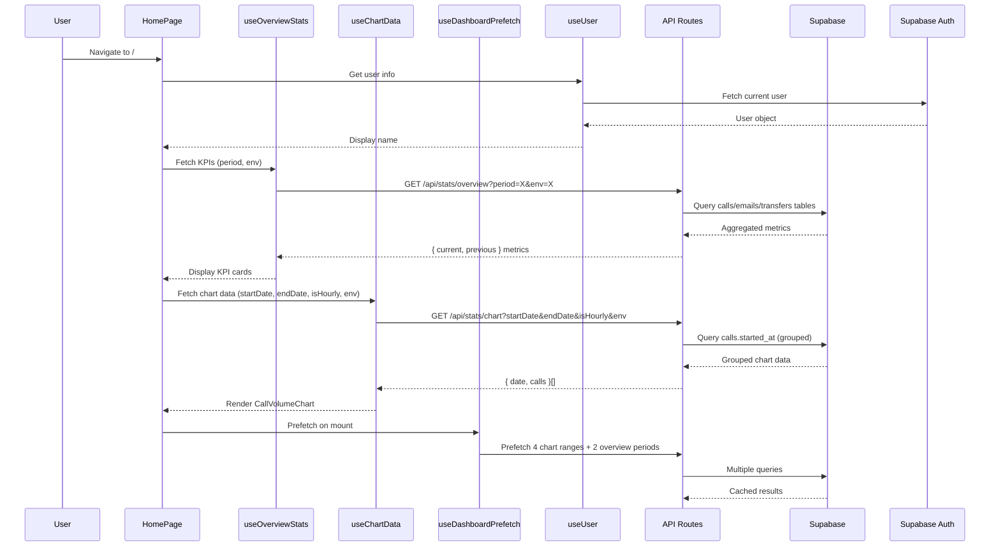
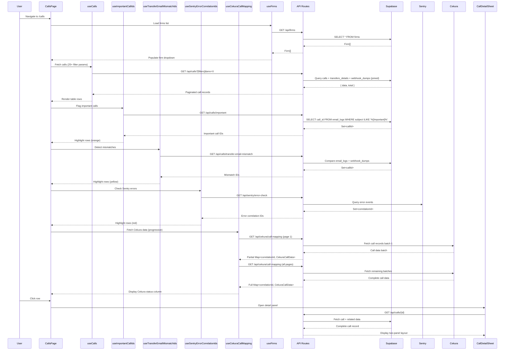
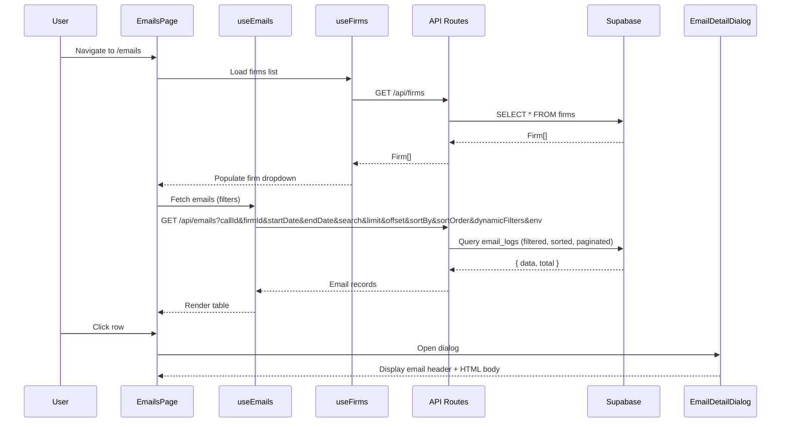
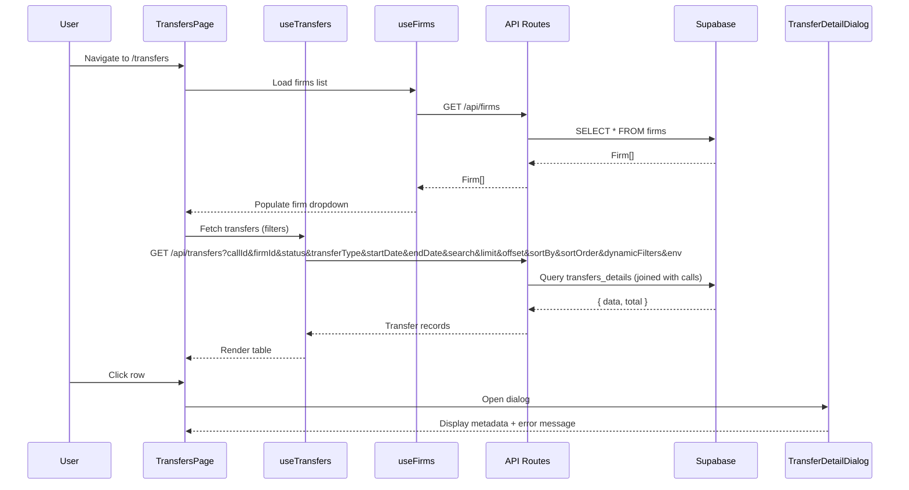
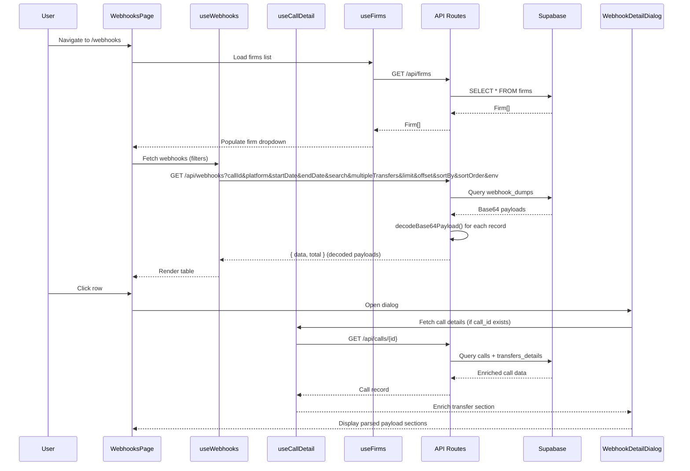
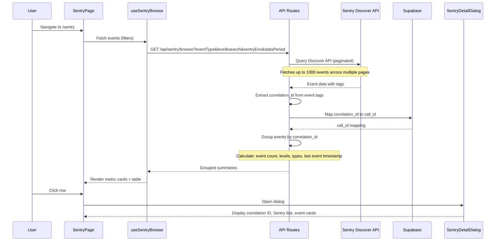
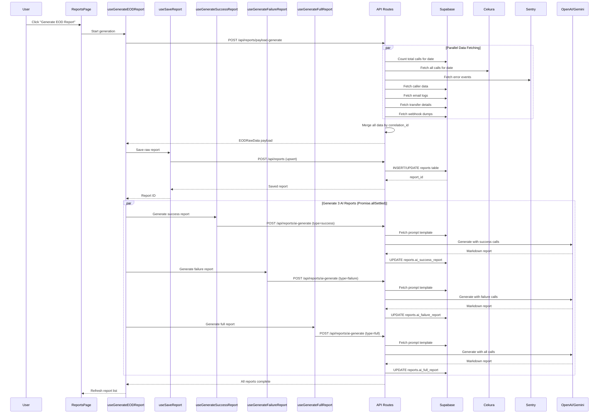
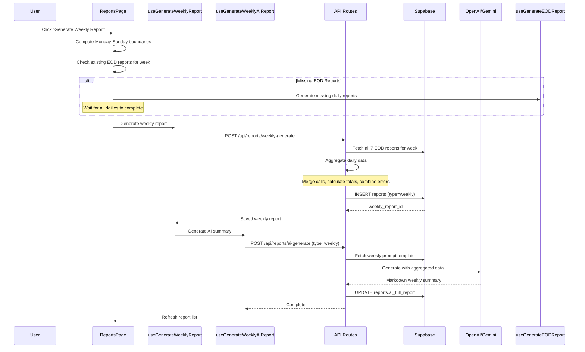
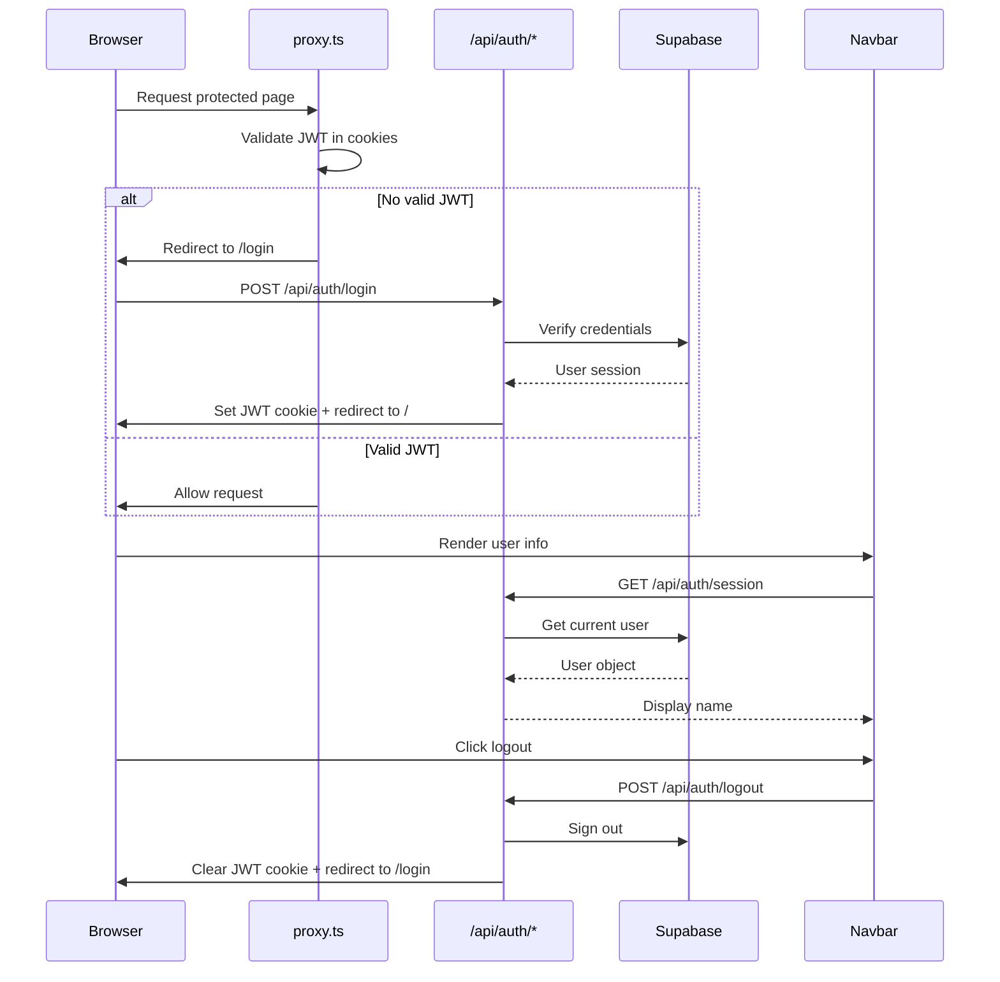

# Page Data Flows

This document traces the complete data pipeline for each page in the AI Receptionist Dashboard — from user interaction through React components, TanStack Query hooks, API routes, and external services.

## Shared Infrastructure

All dashboard pages share:
- **Dashboard Layout** (`app/(dashboard)/layout.tsx`): Wraps pages in QueryProvider > EnvironmentProvider > DateFilterProvider > Navbar + main content
- **Navbar** (`components/layout/navbar.tsx`): Fetches user session via `GET /api/auth/session`, handles logout via `POST /api/auth/logout`, includes environment switcher (prod/staging)
- **Date Filter Context**: Shared `dateFilterMode` (today/yesterday/custom/all) + start/end dates across Calls, Emails, Transfers, Webhooks pages. Persisted in localStorage.
- **Environment Context**: Prod/staging toggle. Stored in localStorage. All hooks pass `?env=` param to API routes. Switching invalidates ALL query caches.

---

## 1. Home Page (`/`)

**File**: `app/(dashboard)/page.tsx`

**Purpose**: KPI overview with call volume charts.



### Components & Data

- **Welcome Header**: Username from `useUser()` with typing animation (sessionStorage tracks if shown)
- **Quick Links Grid**: Static 6 links to other pages
- **4 KPI Cards**:
  - Total Calls (`current.totalCalls`, delta from `previous.totalCalls`)
  - Avg Duration (`current.avgDuration`, delta computed client-side)
  - Transfer Rate (`current.transferRate`, delta computed)
  - Emails Sent (`current.emailsSent`, delta computed)
  - Period selector: Yesterday | Today | This Month
- **CallVolumeChart** (Recharts bar chart):
  - Time range tabs: Yesterday | Day | Week | Month | All
  - Hourly granularity for yesterday/day, daily for week/month/all
  - Data: `{ date: string, calls: number }[]` with zero-filled gaps
  - 4 summary stat cards below chart

### State Management

- `statsPeriod`: Select dropdown state for KPI period
- `timeRange`: Tab state for chart time range

---

## 2. Calls Page (`/calls`)

**File**: `app/(dashboard)/calls/page.tsx`

**Purpose**: Full call record browser with advanced filtering, detail panel, and sharing.



### Table Structure

**Columns (10)**: ID, Correlation ID, Caller Name, Duration, Call Type, Cekura Status, Feedback, Started At, Phone, Status

**Row Highlighting**:
- Red: Sentry error detected
- Yellow: Transfer/email mismatch
- Orange: Long call (>5 min) or Important email

### Filtering Pipeline

The Calls page has the most complex filtering system in the dashboard:

1. **Static Filters**:
   - Firm dropdown
   - Call type dropdown
   - Transfer type dropdown
   - Search input (debounced 300ms)
   - Flagged only toggle
   - Multiple transfers toggle
   - Cekura status filter

2. **Dynamic Filters**:
   - `FilterRow[]` with field/condition/value/combinator (AND/OR)
   - Parsed into `extractedFilters` via useMemo
   - Supports 16 different fields with type-specific conditions

3. **Client-Side Cekura Filtering**:
   - Intersection of Cekura correlation IDs with server results
   - Progressive loading: Page 1 first, then all remaining pages

4. **Impossible Condition Detection**:
   - Detects conflicting AND conditions
   - Returns empty results without fetching when impossible

### Detail Panel (`CallDetailSheet`)

- Opens on row click
- Two-panel resizable layout (panel sizes stored in localStorage)
- Carousel navigation:
  - Previous/Next buttons
  - Wraps across pages
  - Prefetches adjacent call details
- Keyboard navigation support (arrow keys)
- Left panel: Call metadata, timeline, transfer details
- Right panel: Webhook payload, email logs, error logs

### URL Sharing

- `buildShareableUrl()`: Compresses filter state with lz-string into `?s=` param
- `parseShareableUrl()`: Supports both compressed and legacy URL formats
- `useSyncEnvironmentFromUrl()`: Syncs environment from `?e=` param on mount

---

## 3. Emails Page (`/emails`)

**File**: `app/(dashboard)/emails/page.tsx`

**Purpose**: Email log browser with detail dialog.



### Table Structure

**Columns (7)**: ID, Call ID, Type (badge), Subject (truncated), Recipients, Status, Sent At

### Filters

- Date mode (shared via DateFilterProvider)
- Search input (debounced 300ms)
- Firm dropdown
- Dynamic filters (7 available fields):
  - id, call_id, email_type, subject, recipients, status, sent_at

### Email Detail Dialog

- Email header card: Type, Status, Sent timestamp
- Recipients list
- Subject line
- `EmailBodyDisplay`: Renders HTML email body in sandboxed iframe

### Sorting

Supports sorting by:
- `id` (default descending)
- `sent_at`

---

## 4. Transfers Page (`/transfers`)

**File**: `app/(dashboard)/transfers/page.tsx`

**Purpose**: Transfer record browser with detail dialog.



### Table Structure

**Columns (7)**: ID, Call ID, Transfer Type (badge), Recipient Name, Phone, Status (badge), Started At

### Filters

- Date mode (shared via DateFilterProvider)
- Search input (debounced 300ms)
- Firm dropdown
- Status dropdown (completed, failed, all)
- Transfer Type dropdown (assistant-request, phone-number)
- Dynamic filters (10 available fields):
  - id, call_id, transfer_type, recipient_name, phone_number, status, error_message, metadata, transfer_started_at, transfer_ended_at

### Transfer Detail Dialog

**Header Section**:
- Status badge (completed/failed)
- Transfer type badge

**External Links**:
- VAPI Dashboard link (correlation ID)
- Sentry Logs link (correlation ID)

**Metadata Grid**:
- Recipient name
- Phone number
- Started at timestamp
- Ended at timestamp
- Duration (if completed)
- Error message (if failed)

**Raw Metadata**: JSON viewer for full metadata object

### Sorting

Supports sorting by:
- `id` (default descending)
- `transfer_started_at`

---

## 5. Webhooks Page (`/webhooks`)

**File**: `app/(dashboard)/webhooks/page.tsx`

**Purpose**: Webhook payload browser with parsed payload detail view.



### Table Structure

**Columns (6)**: ID, Call ID, Platform (badge), Correlation ID, Webhook Type (badge), Received At

### Filters

- Date mode (shared via DateFilterProvider)
- Search input (debounced 300ms, searches correlation_id)
- Firm dropdown
- Platform dropdown (vapi, bland, all)
- Multiple Transfers toggle (special client-side filter)

### Multiple Transfers Filter

This is a unique client-side filter:

1. Fetches ALL webhook records (ignores pagination)
2. Decodes ALL base64 payloads client-side
3. Filters for records with `message.phoneNumberDetails.length > 1`
4. Applies pagination client-side to filtered results

### Webhook Detail Dialog

**Parsed Payload Sections** (all collapsible):

1. **Squad Overrides**: Display squad-level configuration overrides
2. **Assistant Overrides**: Display assistant-level configuration overrides
3. **Structured Outputs**: Display extracted structured data
4. **Transfers**: Enriched transfer details (merged with DB data from `useCallDetail`)
5. **Full Payload**: JSON viewer with syntax highlighting

### Sorting

Supports sorting by:
- `id` (default descending)
- `received_at`

---

## 6. Sentry Page (`/sentry`)

**File**: `app/(dashboard)/sentry/page.tsx`

**Purpose**: Sentry error event browser grouped by correlation ID.



### Key Differences

**Does NOT use shared DateFilterProvider**. Has its own time period filter.

### Components

**3 Metric Cards**:
- Total Events: Count of all Sentry events
- Unique Calls: Count of unique correlation IDs
- Mapped to DB: Percentage of correlation IDs found in Supabase

**Summary Table**: Grouped by `correlation_id`

### Table Structure

**Columns (6)**: Call ID, Correlation ID, Events (badge count), Level (icon + badge), Types, Last Event

### Filters

- Event Type dropdown (error, default, transaction, all)
- Level dropdown (error, warning, info, debug, all)
- Stats Period (24h, 7d, 30d)
- Sentry Environment dropdown (production, staging, all)
- Search input (searches correlation_id)

### Sentry Detail Dialog

**Header**:
- Correlation ID (copy button)
- Sentry Explorer link (opens in new tab)

**Event Cards** (expandable):
- Level badge + timestamp
- Event type
- Message/title
- Endpoint (if available)
- Exception details:
  - Type
  - Value
  - Stacktrace (first 3 frames)

### Data Flow Notes

- No pagination in UI (all events loaded at once)
- Sentry API pagination handled server-side
- Events fetched in batches of 100, up to 1000 total
- Grouping and correlation ID mapping done server-side

---

## 7. Reports Page (`/reports`)

**File**: `app/(dashboard)/reports/page.tsx`

**Purpose**: EOD and weekly report generation, viewing, AI insights, and sharing.

### EOD Report Generation Flow



### Weekly Report Generation Flow



### Table Structure

**Columns (6)**: Report Date, Calls, Errors (badge), Trigger (badge), Generated At, AI Reports (status icons)

**Report Type Tabs**: EOD | Weekly

### Filters

- Report Type tabs (switches between EOD and Weekly reports)
- Firm dropdown
- Date picker (filters by report_date)

### Data Format Options

Reports support two data formats for LLM input:

1. **JSON** (default): Standard JSON format
2. **TOON** (Token-Optimized Object Notation): Compact format that reduces token count by 30-40%

Format is configurable in the prompt template stored in Supabase `prompts` table.

### EOD Report Detail Panel

**Full-screen overlay** with resizable two-panel layout (desktop) or tabbed layout (mobile).

**Left Panel**:
- **Summary Stats**:
  - Total Calls (with % change vs previous day)
  - Failure Calls (with % change)
  - Success Calls (with % change)
- **Metadata Card**:
  - Report date
  - Generated timestamp
  - Trigger (manual/scheduled)
  - Environment
- **Tabs**:
  - Errors: List of Sentry errors with links
  - Raw Data: JSON viewer with full EODRawData

**Right Panel**:
- **AI Reports Tabs**:
  - Failure Analysis (markdown rendered)
  - Success Analysis (markdown rendered)
  - Full Report (markdown rendered)
- **Actions per tab**:
  - Export PDF (uses jsPDF + html2canvas)
  - Copy markdown to clipboard
  - Regenerate report (calls appropriate AI generation hook)

**Mobile Layout**: Single tabbed interface combining all sections

### Weekly Report Detail Panel

Similar layout to EOD but:
- Shows week range instead of single date
- Summary stats show full week aggregates
- Only one AI report tab (Full Report)
- Raw data shows aggregated weekly payload

### URL Sharing

Reports support shareable URLs with format:

```
/reports?report=DDMMYYYY&type=eod&e=production
/reports?report=DDMMYYYY&type=weekly&e=production
```

- `report`: Date in DDMMYYYY format
- `type`: `eod` or `weekly`
- `e`: Environment (`production` or `staging`)

On page load, `useSyncReportFromUrl()` opens the detail panel if URL params are present.

---

## Data Flow Summary Table

| Page | Primary Hooks | API Endpoints | External Services | Supabase Tables |
|------|--------------|---------------|-------------------|----------------|
| Home | useOverviewStats<br>useChartData<br>useDashboardPrefetch<br>useUser | /api/stats/overview<br>/api/stats/chart | Supabase Auth | calls<br>emails<br>transfers |
| Calls | useCalls<br>useCekuraCallMapping<br>useImportantCallIds<br>useTransferEmailMismatchIds<br>useSentryErrorCorrelationIds<br>useFirms | /api/calls<br>/api/cekura/call-mapping<br>/api/calls/important<br>/api/calls/transfer-email-mismatch<br>/api/sentry/error-check<br>/api/firms | Cekura API<br>Sentry API | calls<br>transfers_details<br>webhook_dumps<br>email_logs<br>firms |
| Emails | useEmails<br>useFirms | /api/emails<br>/api/firms | - | email_logs<br>firms |
| Transfers | useTransfers<br>useFirms | /api/transfers<br>/api/firms | - | transfers_details<br>calls<br>firms |
| Webhooks | useWebhooks<br>useCallDetail<br>useFirms | /api/webhooks<br>/api/calls/{id}<br>/api/firms | - | webhook_dumps<br>calls<br>transfers_details<br>firms |
| Sentry | useSentryBrowse | /api/sentry/browse | Sentry Discover API | calls (for correlation mapping) |
| Reports | useEODReports<br>useWeeklyReports<br>useGenerateEODReport<br>useGenerateWeeklyReport<br>useGenerateSuccessReport<br>useGenerateFailureReport<br>useGenerateFullReport<br>useGenerateWeeklyAIReport<br>useSaveReport<br>useFirms | /api/reports<br>/api/reports/payload-generate<br>/api/reports/weekly-generate<br>/api/reports/ai-generate<br>/api/firms | Cekura API<br>Sentry API<br>OpenAI/Gemini LLM | calls<br>transfers_details<br>email_logs<br>webhook_dumps<br>reports<br>prompts<br>firms |

---

## Common Query Patterns

### Pagination

All list pages use consistent pagination:
- Default page size: 25
- Maximum page size: 100
- Offset-based pagination: `limit` + `offset` params
- Server returns: `{ data: T[], total: number }`
- Client calculates total pages: `Math.ceil(total / limit)`

### Filtering

Three filtering approaches across pages:

1. **Static Filters**: Direct query params (firm, status, platform, etc.)
2. **Dynamic Filters**: `FilterRow[]` structure with field/condition/value/combinator, serialized as JSON in URL
3. **Search**: Debounced text input (300ms delay), searches specific fields per page

### Sorting

Supported on Calls, Emails, Transfers, Webhooks pages:
- URL params: `sortBy` (field name), `sortOrder` ('asc' | 'desc')
- Default: Primary key descending (most recent first)
- Table headers clickable to toggle sort

### Date Filtering

Calls, Emails, Transfers, Webhooks pages share `DateFilterProvider`:
- Modes: today, yesterday, custom, all
- Custom mode: Date range picker
- Stored in localStorage
- Automatically converts to UTC boundaries for API calls

### Environment Switching

Global `EnvironmentProvider`:
- Toggle: Production | Staging
- Stored in localStorage (`environment` key)
- Invalidates ALL TanStack Query caches on switch
- All API routes check `?env=` param to select Supabase client

### Prefetching

Home page implements aggressive prefetching via `useDashboardPrefetch`:
- Prefetches 4 chart time ranges on mount
- Prefetches 2 overview stat periods
- Uses TanStack Query's `prefetchQuery` for background loading
- Improves perceived performance when user switches tabs

---

## Performance Optimizations

### Client-Side

1. **Debounced Search**: 300ms delay prevents excessive API calls during typing
2. **Memoized Filters**: `useMemo` for complex filter transformations (especially Calls page)
3. **Progressive Loading**: Cekura data loads page 1 first, then fetches all remaining pages
4. **localStorage Caching**: Panel sizes, date filters, environment preference cached locally
5. **TanStack Query**: 60s stale time for data, 300s for firms list, automatic background refetch

### Server-Side

1. **Indexed Queries**: All Supabase queries use indexed columns for filtering/sorting
2. **Pagination**: Limits result sets to 25-100 records per request
3. **Connection Pooling**: Supabase client singleton per environment
4. **Early Returns**: Impossible filter conditions return empty results without querying
5. **Parallel Fetching**: Reports page fetches from multiple sources in parallel

### API Route Patterns

All API routes follow consistent patterns:
- JWT validation via proxy
- Environment detection from `?env=` param
- Input sanitization (SQL injection prevention via `escapeLikePattern()`)
- Error handling with structured error responses
- Response caching headers (where appropriate)

---

## Error Handling

### Client-Side

TanStack Query error handling:
- `onError` callbacks for user-facing notifications
- `retry: false` for most queries (no automatic retries)
- Error boundary at app root catches rendering errors

### Server-Side

API route error patterns:
- 400: Bad request (invalid params)
- 401: Unauthorized (JWT validation failed)
- 404: Not found (resource doesn't exist)
- 500: Internal server error (caught exceptions)

All errors return structured JSON:
```json
{
  "error": "Human-readable message",
  "details": "Additional context (dev only)"
}
```

---

## Authentication Flow



### Session Management

- JWT stored in HTTP-only cookie
- Validated on every request by `proxy.ts`
- Session data cached in TanStack Query (5min stale time)
- Logout clears cookie and invalidates all queries

---

## State Management Summary

| State Type | Technology | Persistence | Scope |
|------------|-----------|-------------|-------|
| Server state | TanStack Query | In-memory cache | Per query key |
| URL state | Next.js router | URL params | Per page |
| Form state | React state | Component only | Local |
| User preferences | localStorage | Browser storage | Global |
| Global UI state | React Context | Component tree | Global |
| Date filters | Context + localStorage | Both | Shared pages |
| Environment | Context + localStorage | Both | Global |

---

## Future Considerations

### Potential Optimizations

1. **Virtual Scrolling**: For very large tables (1000+ rows)
2. **Request Deduplication**: TanStack Query handles this, but could optimize parallel calls
3. **Incremental Loading**: Load Cekura data only for visible rows
4. **Service Worker**: Cache static assets and API responses offline
5. **WebSockets**: Real-time updates for new calls/webhooks

### Scalability Notes

Current architecture handles:
- Up to 10,000 calls per day
- Up to 1,000 webhook events per request (Sentry page limit)
- Up to 100 concurrent users

Bottlenecks to monitor:
- Supabase connection pool (limited to 25 connections)
- Cekura API rate limits (unknown)
- Sentry API rate limits (1000 events per request)
- Client-side memory (large Cekura maps on Calls page)
